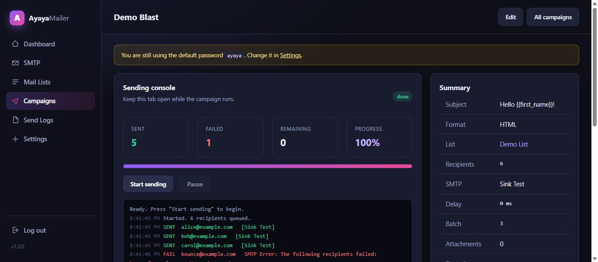
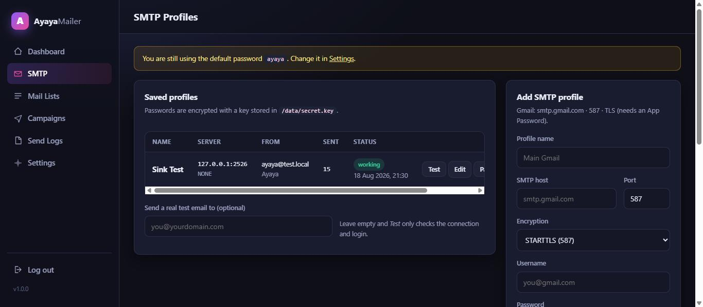
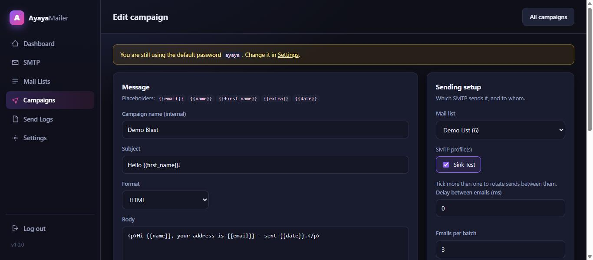

# Ayaya Mailer

A self-hosted SMTP mailing app that runs on plain **XAMPP**. Save as many SMTP
profiles as you like, upload your recipients as a `.txt` file, pick a profile,
and send — with live progress, pause/resume and a full send log.

No Composer, no MySQL setup, no CDN. Drop it in `htdocs` and open it.



<p align="center">
  
  
</p>

---

## Features

- **Multiple SMTP profiles** — host, port, STARTTLS/SSL/none, username, password,
  From name/address, Reply-To, hourly cap, active toggle. Passwords are stored
  encrypted (AES-256-CBC) with a key generated on your machine.
- **One-click SMTP test** — checks connection + login only, or sends a real test
  email, and shows the raw SMTP conversation when something fails.
- **`.txt` recipient upload** — one address per line, several files at once, or
  paste them straight into the box. Duplicates and invalid lines are dropped and
  reported.
- **Campaigns** — subject + HTML or plain-text body, attachments, personalisation
  placeholders, delay between mails, batch size.
- **SMTP rotation** — tick more than one profile and sends alternate between them.
- **Live sending console** — progress bar, sent/failed counters, per-recipient log,
  pause and resume at any time. Closing the tab just pauses; nothing is lost.
- **Smart failure handling** — a dead server or a bad login pauses the campaign and
  leaves the remaining addresses queued instead of burning through your list.
  Only real per-recipient rejections (550 and friends) are marked failed, and
  those can be retried in one click.
- **Send logs** — searchable, filterable, exportable to CSV.
- **AI Lead Finder** — uses the OpenAI Responses API with web search to discover
  recently launched Nigerian businesses, match evidence against returned search
  sources, score fit, and prepare an individual draft for human review. Approved
  leads are sent one at a time.
- **Replies Inbox** — synchronizes configured mailboxes over read-only IMAP,
  displays incoming messages, and links replies back to matching Lead Finder leads.
- **Password lock** — the whole app sits behind a single password.

## Requirements

- XAMPP with **PHP 7.4+** (tested on PHP 8.2)
- PHP extensions `pdo_sqlite`, `openssl`, and `imap`
- PHP extension `curl` and an OpenAI API key for Lead Finder
- No database server needed: storage is a single SQLite file in `data/`

## Install

1. Copy this folder into `C:\xampp\htdocs\` so you have `C:\xampp\htdocs\ayaya-mailer`.
2. Start **Apache** from the XAMPP control panel (MySQL is not used).
3. Open <http://localhost/ayaya-mailer/>.
4. Log in with the default password **`ayaya`**, then change it in *Settings*.

That is the whole install — the database, the encryption key and the folders are
created on first load.

```bash
git clone https://github.com/<your-user>/ayaya-mailer.git
# then move it into htdocs, or clone directly there
```

## How to send

1. **SMTP** → add a profile → **Test** to confirm it connects.
2. **Mail Lists** → upload your `.txt` file (or paste addresses) → the list is imported.
3. **Campaigns → New campaign** → write the subject and body, choose the list and
   the SMTP profile(s), set the delay and batch size → **Create campaign**.
4. On the campaign page, send yourself a **test**, then press **Start sending** and
   watch the console. Pause whenever you want; **Resume** picks up exactly where it
   stopped.

## AI Lead Finder

1. Open **Lead Finder** and save an OpenAI API key, sender name, Jojo Chat URL,
   daily limit, and default SMTP profile.
2. Run a search. OpenAI web research uses the configured launch-age window and
   adds only leads whose launch and contact URLs occur in the API's returned web
   sources, whose contact page belongs to the business domain, and whose fit score
   is at least 60.
3. Open each lead, verify both evidence links, edit the draft, tick the evidence
   confirmation, and approve it. Editing an approved draft revokes its approval.
4. Send the approved email individually. New leads are never sent automatically.

Send claims and SMTP hourly slots are reserved atomically before delivery, so a
double click or overlapping request cannot send the same lead twice. Daily limits
use Lagos local-day boundaries, while timestamps are stored in UTC. Do-not-contact
actions suppress both the email address and normalized business domain.

For daily discovery without automatic sending, create a Windows Task Scheduler
task that runs:

```text
C:\xampp\php\php.exe C:\xampp\htdocs\ayaya-mailer\scripts\discover-leads.php 5
```

The API key is encrypted in SQLite with `data/secret.key`. API usage is billed
by OpenAI separately from a ChatGPT subscription.

## Google Maps lead import

Ayaya can import public business websites and email addresses from the local
[gosom/google-maps-scraper](https://github.com/gosom/google-maps-scraper) service.
On Windows, Ayaya downloads and SHA-256 verifies the scraper automatically into
its ignored `data/` folder, so no separate repository or Docker installation is
needed.

1. Open **Google Maps** in Ayaya and click **Install and start scraper
   automatically**. The first setup downloads about 60 MB and starts the local
   API on `http://127.0.0.1:8088`.

2. Enter focused searches such as `media companies in Ajao Estate Lagos
   Nigeria`, start a scrape, wait for it to finish, and import the results.

If automatic setup is unavailable, the Google Maps page includes manual binary
and Docker instructions. The scraper project is MIT licensed and runs only on
your computer; Ayaya does not send searches or emails automatically.

Only rows with a valid website and public email are imported. Placeholder
addresses are discarded, duplicates are skipped, and imported Maps leads stay
unverified until you add dated launch evidence in **Lead Finder**. Review every
result and honor opt-out requests before sending.

## Replies Inbox

1. Open **SMTP**, edit a sending profile, and enable **Replies inbox (IMAP)**.
2. Enter the provider's IMAP host and port. Hostinger normally uses
   `imap.hostinger.com`, port `993`, with SSL/TLS.
3. Reuse the SMTP login when the sending address and receiving mailbox have the
   same credentials, or enter separate IMAP credentials.
4. Test the inbox connection, then open **Replies Inbox** and select **Sync inbox**.

Inbox access is read-only. Messages are cached locally for viewing and locally
marked read/unread; synchronization does not change their read state on the mail server.

### Recipient file format

One recipient per line. All of these work and can be mixed in the same file:

```
john@example.com
jane@example.com,Jane Doe
bob@example.com;Bob;VIP customer
Carol Danvers <carol@example.com>
# lines starting with a hash are ignored
```

The second field becomes `{{name}}`, anything after it becomes `{{extra}}`.

### Placeholders

Usable in both the subject and the body:

| Placeholder      | Becomes                                    |
| ---------------- | ------------------------------------------ |
| `{{email}}`      | the recipient's address                    |
| `{{name}}`       | the name from the list (falls back to the first name) |
| `{{first_name}}` | first word of the name, or the part before `@` |
| `{{extra}}`      | the third column of the list line          |
| `{{date}}`       | today, as `YYYY-MM-DD`                     |
| `{{time}}`       | current time, as `HH:MM`                   |

## Common SMTP settings

| Provider  | Host                 | Port | Encryption |
| --------- | -------------------- | ---- | ---------- |
| Gmail     | smtp.gmail.com       | 587  | STARTTLS   |
| Outlook   | smtp.office365.com   | 587  | STARTTLS   |
| Yahoo     | smtp.mail.yahoo.com  | 465  | SSL/TLS    |
| Zoho      | smtp.zoho.com        | 465  | SSL/TLS    |
| Hostinger | smtp.hostinger.com   | 465  | SSL/TLS    |
| Mailtrap  | sandbox.smtp.mailtrap.io | 2525 | STARTTLS |

Gmail and Yahoo need an **app password**, not your account password.

## Troubleshooting

**"Could not connect to SMTP host"** — wrong port/encryption pair (587 wants
STARTTLS, 465 wants SSL/TLS), or your ISP/antivirus blocks outgoing SMTP. Try the
other port first.

**"SMTP Error: Could not authenticate"** — for Gmail/Yahoo/Outlook this is nearly
always a normal password where an app password is required.

**Certificate errors on a local relay** — tick *Skip TLS certificate verification*
on the profile. Only do that for local or self-signed servers.

**Sending is slow** — lower the delay and raise the batch size on the campaign.
Delay `0` and batch `25` is fast; keep a delay if your provider throttles.

**The tab was closed mid-campaign** — nothing is lost. Reopen the campaign and
press **Resume sending**.

## Project layout

```
ayaya-mailer/
├── index.php            dashboard
├── smtp.php             SMTP profiles (add / edit / test)
├── lists.php            .txt import and list browsing
├── campaign.php         campaign composer
├── send.php             sending console
├── campaigns.php        all campaigns
├── logs.php             send log + CSV export
├── settings.php         password, maintenance, environment
├── api.php              AJAX: SMTP test + batched sending
├── includes/            bootstrap, db, helpers, auth, mailer, layout
├── lib/PHPMailer/       PHPMailer 6.9.3, bundled (LGPL-2.1)
├── assets/              app.css, app.js, favicon
├── data/                SQLite database + encryption key  (not in git)
└── uploads/             imported lists and attachments    (not in git)
```

Back up `data/` and you have backed up everything.

## Security notes

- Ayaya Mailer is built for **localhost**. If you expose it to a network, put it
  behind HTTPS and change the default password first.
- SMTP passwords are encrypted at rest with `data/secret.key`. That key never
  leaves your machine and is excluded from git — if you lose it, re-enter the
  passwords.
- `data/`, `includes/` and `lib/` are blocked from web access by `.htaccess`.

## Responsible use

Send to people who asked to hear from you. Bulk mail to purchased or scraped
lists gets your SMTP account banned within hours and, depending on where you and
your recipients are, breaks the law (CAN-SPAM, GDPR, PECR). Include a real way to
unsubscribe.

## Credits

Built on [PHPMailer](https://github.com/PHPMailer/PHPMailer) (LGPL-2.1).
Ayaya Mailer itself is released under the MIT licence — see `LICENSE`.
